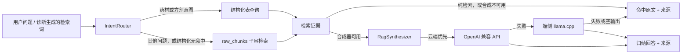

# 倪海厦中医问答


## 下载安装

- **Android APK(下载即用)**：[app-release.apk](https://github.com/heroims/nihaixia_ai/releases/download/v0.1.0-beta/app-release.apk)
- **iOS IPA(需用三方导入安装证书)**：[nihaixia_app.ipa](https://github.com/heroims/nihaixia_ai/releases/download/v0.1.0-beta/nihaixia_app.ipa)

更多版本请见 [Releases 页面](https://github.com/heroims/nihaixia_ai/releases)。

一个离线优先的 Flutter 中医学习工具：把可追溯的倪海厦经方知识库、结构化检索、端侧 GGUF 模型和可选云端增强组合在同一条问答链路里。项目重点不是替代医生，而是展示一个可解释、可降级、可测试的 AI 应用工程实现。

> 本 App 仅用于中医学习与研究，不构成医疗建议。如有健康问题，请咨询执业医师。

## 你可以用它做什么

- **自由问答**：从内置 SQLite 知识库检索经方、药材、条文和医案，并展示来源。
- **引导式诊断**：通过四步症状问卷整合寒热、汗出、疼痛、口渴和发热，提交后才调用统一的检索与推理链；信息不足时不发起请求。
- **端侧 RAG**：配置 Qwen3 GGUF 后，可在设备本地基于检索到的资料生成归纳回答，断网也能工作。
- **云端增强**：在设置中填写 OpenAI 兼容 Base URL、API Key 和模型名后，可启用云端优先问答、拍照分析和 Live 对话；云端失败会自动回到端侧或原文检索。
- **可追溯回答**：回答与 `source · heading` 来源列表分离展示，便于复核原文。

## 问答处理流程

本项目实现了 **RAG（Retrieval-Augmented Generation，检索增强生成）**：先从本地知识库取回与问题相关的原文证据，再把问题和证据交给模型生成回答，并将来源一并展示。这里的“检索”采用 SQLite `LIKE` 子串匹配，而非向量检索；RAG 的关键在于“检索证据参与生成”，并不要求使用向量数据库。

刻意不用向量检索有两方面原因：

- **性能**：知识库只有约 2600 条段落（整个 `kb.sqlite3` 约 10MB），`LIKE` 全表扫描在手机上就是毫秒级、零额外依赖；换成向量则每次提问都要先跑一遍 embedding 模型的前向推理，还要在端侧常驻一个向量模型的内存占用、安装包体积和耗电——在这个量级的语料上是纯开销。
- **效果**：知识库以《伤寒论》条文类文言文为主，通用中文 embedding 模型很难把“感冒怕冷”这类现代口语和“恶寒”这类古文术语对齐到同一语义空间；而内置同义词表加上多信号打分（命中词数、词频、标题与来源加权）已经针对性地解决了古今词差异的召回问题，泛化向量的效果反而未必更好。

如果将来确实需要向量能力，性价比更高的做法是把 embedding 放到云端完成、端侧只接收 top-k 结果，而不是在设备本地再背一个向量模型。

`InferenceSession` 为自由问答和引导式诊断共享同一个 `QaService`，并按设置接入三种模式：纯检索不创建合成器；端侧模型只接入本地 llama.cpp；云端优先同时接入 OpenAI 兼容接口和可用的端侧模型。模型加载、云端配置或生成失败都不会中断检索路径。



具体顺序与代码一致：药材/方剂意图先查询 `herbs`、`formulas`、`tiao_wen`；三者都未命中才查询 `raw_chunks`。通用查询直接查询 `raw_chunks`。命中证据最多取前 8 条交给 `RagSynthesizer` 生成；若未配置生成通道、生成异常或结果为空，则直接拼接前 5 条原文返回。无论回答来自云端、端侧还是原文，UI 都单独展示前 5 条来源。

## 知识库如何分块并存入 SQLite

知识库由 `tools/build_kb.py` 从上游 Markdown 构建为 `app/assets/kb/kb.sqlite3`。这里不使用向量、嵌入或 FTS5：目标是让资料包可离线随 App 分发，并用 SQLite 的普通文本列保存可追溯的原文；同时避免端侧 embedding 模型带来的推理延迟、内存与包体积开销（原因见「问答处理流程」）。

### Markdown 分块规则

通用资料进入 `raw_chunks` 前由 `tools/parsers/chunker.py` 处理：

1. 依次尝试按 `##`、`###`、`####` 标题切分，选第一个能得到超过 5 个段落的层级；若都不足 5 个，则使用最后一个可用层级。
2. 每个段落保留所属 `heading`；空段落会被跳过。
3. 段落正文默认最多 800 个字符。超长时优先在前 800 个字符中、后半段出现的最近换行处分开；找不到合适换行才按 800 字符截断。
4. 每个块都携带 `source`、`heading` 与原文 `text`，因此展示检索结果时可以回到资料来源和标题。

分块覆盖所有 `modules/*.md`、`SKILL.md` 和三份 distilled 参考资料。标题和正文不做中文词典分词；查询时才按空白、同义词、已知关键词和连续中文片段处理。连续中文短语会保留为完整匹配信号；超过 4 字的长句额外生成重叠二元字串，帮助 `LIKE` 在无空格中文中召回相关段落。

### SQLite 表结构与特点

| 表 | 存储内容 | 结构特点 |
|---|---|---|
| `herbs` | 本草药物 | 药名、性味、分类、主治、剂量、禁忌及原始/不同版本注释分列保存，便于按药名查询和展示细节。 |
| `formulas` | 方剂公式 | 方名、标题、主证、代表模式、出处引用分列保存。 |
| `tiao_wen` | 经方条文 | 条文号、标题、正文、方剂提示、来源分列；仅 `source` 建有索引，适合按出处筛选。 |
| `cases` | 医案 | 标题、正文、症状、方剂、分类、来源分列，保留诊疗记录的分类和上下文。 |
| `acupoints` | 穴位资料 | 穴名、经络、位置、主治和正文分列。 |
| `raw_chunks` | 通用 Markdown 段落 | 最小的通用检索单元：`id`、`source`、`heading`、`text`；保留原文及其定位信息。 |

所有表使用自增整数 `id` 作主键。结构化表用于药物、方剂、条文等明确实体的字段检索；`raw_chunks` 用于兜底检索。运行时会把打包在 Flutter assets 中的数据库复制到应用支持目录，只有本地副本缺失或大小与资产不一致时才重新覆盖，随后由 Drift 打开。

检索采用 SQLite `LIKE` 的字面子串匹配，标题和正文都会参与通用段落检索；命中的不同查询词数量、词频、标题命中与资料来源在 Dart 侧共同决定排序。这样无需额外中文分词器，部署简单、结果可复核；代价是没有 FTS5 的倒排索引，面对特别长或措辞差异很大的中文查询，召回能力会受限。

核心代码按职责分层：

```text
app/lib/
├── core/       Drift 数据库、模型和资源加载
├── retrieval/  意图路由、同义词、结构化查询、检索和答案组装
├── llm/        GGUF 模型解析、llama.cpp 服务、提示词和答案合成
├── cloud/      OpenAI 兼容客户端、拍照分析和 Live 对话
├── rules/      诊断编排服务与可解释规则基线
└── ui/         问答、诊断、设置和来源/免责声明组件
tools/
├── parsers/    Markdown → 结构化记录的解析器
└── build_kb.py 生成 app/assets/kb/kb.sqlite3
```

## 快速开始

### 1. 准备 Python 工具链和知识库

```bash
cd tools
python3 -m venv .venv
.venv/bin/pip install -r requirements.txt
git clone --depth 1 https://github.com/jangviktor-web/nihaixia.git data/nihaixia
.venv/bin/python build_kb.py --repo data/nihaixia --out out
cp out/kb.sqlite3 ../app/assets/kb/kb.sqlite3
```

知识库原始仓库使用 MulanPSL-2.0；`tools/data/` 和 `tools/out/` 被 `.gitignore` 排除，避免把源资料和构建产物提交进来。

### 2. 准备端侧模型

纯检索逻辑不依赖模型，但当前 `pubspec.yaml` 将模型路径注册为 Flutter asset，因此要执行 `flutter test` 或构建 App，需先放置文件：

| 项 | 值 |
|---|---|
| 模型 | `Qwen3.5-0.8B-Q6_K.gguf` |
| 来源 | [ModelScope：Qwen3.5-0.8B-GGUF](https://www.modelscope.cn/models/lmstudio-community/Qwen3.5-0.8B-GGUF) |
| 目标路径 | `app/assets/models/Qwen3.5-0.8B-Q6_K.gguf` |
| 体积 | 约 628MB |
| 许可 | Apache-2.0（以模型仓库说明为准） |

模型文件已被 `*.gguf` 忽略，不会入库。首次运行时 `LlmModelResolver` 会把打包资源复制到应用文档目录，之后由文件系统路径加载。

### 3. 运行 Flutter App

```bash
cd app
flutter pub get
flutter run
```

没有可用模型时，运行时会降级到纯检索；如果要验证这个降级路径，可以在设置页选择“纯检索”。

## 品牌资源与平台启动页

本项目使用“经方印章”视觉系统：朱砂红 `#9E3D32`、宣纸米色 `#F3EAD8`、墨色 `#3F2B25` 和旧金 `#C9A67E`。源文件和生成器位于 [`app/assets/branding/`](app/assets/branding/)：

```bash
brew install librsvg
python3 app/assets/branding/generate_assets.py --root .
```

生成器会更新 Android `mipmap-*`、Android 启动图、iOS `AppIcon.appiconset` 和 `LaunchImage.imageset`。资源接入说明见 [`app/assets/branding/README.md`](app/assets/branding/README.md)。

## 测试与构建

```bash
cd app
flutter analyze
flutter test
flutter build apk --debug
flutter build ios --no-codesign --simulator
```

`flutter test` 默认跳过需要真实模型的测试；模型就位后可显式运行：

```bash
flutter test --run-skipped test/llm_real_test.dart
```

工具链单测需要先安装 `tools/requirements.txt`：

```bash
cd tools
.venv/bin/python -m pytest
```

## 已知限制与取舍

- 检索主路径刻意不依赖 FTS5、jieba 或端侧向量检索，使用 SQLite `LIKE` + Dart 侧评分：小语料下更快更省资源，同义词表对古今词差异的覆盖也优于通用 embedding；代价是中文长查询的召回仍有限。
- 部分 `tiao_wen` 结构化命中未排序；端侧/云端合成可缓解，纯检索模式下可能看到原文噪声。
- 端侧模型约 628MB（Qwen3.5-0.8B-Q6_K），首次复制和加载需要时间，设备内存也会影响体验。
- `llama_cpp_dart` 的原生库已随 Android/iOS 工程预置；本地真机构建仍需要对应 Xcode、CocoaPods、JDK/NDK 环境。
- 云端能力需要用户自行提供兼容 API 配置；API Key 仅存本机 Keychain/Keystore，不在仓库中保存。

## Qwen3.5 原生推理层升级

`Qwen3.5-0.8B-Q6_K.gguf` 的 GGUF 架构标识是 `qwen35`，旧版 llama.cpp 只认识 `qwen3`，因此会在模型加载阶段报 `unknown model architecture`。本项目已将 `app/third_party/llama_cpp_dart/src/llama.cpp` 升级到包含 Qwen3.5/Qwen3.5-MoE 图实现的上游快照 `b21e4de`，并保留 `llama_abi_shim` 兼容现有 Dart FFI。

升级要点：

- `llama-arch`、GGUF 元数据和 Qwen3.5/线性注意力算子一并升级，不能只添加一个架构枚举。
- ABI shim 将旧的 `llama_kv_cache_clear` 映射到新版本的 memory API，旧 Dart 接口无需改动。
- 旧 Dart ABI 没有单独的 `n_ubatch` 字段，shim 将物理批大小限制为 512；如果把 `n_batch=4096` 直接传给 `n_ubatch`，iOS Metal 可能在创建 context 时分配失败并触发原生崩溃。
- Android 已预编译 `arm64-v8a` 和 `x86_64` 的 `libllama.so`；iOS `xcframework` 同时更新真机和模拟器静态库。

若需要重新生成原生库，使用 Android NDK 和 CMake（路径按本机环境调整）：

```bash
cmake -S app/third_party/llama_cpp_dart/src \
  -B /tmp/llama-android-arm64 \
  -DCMAKE_TOOLCHAIN_FILE="$ANDROID_NDK/build/cmake/android.toolchain.cmake" \
  -DANDROID_ABI=arm64-v8a -DANDROID_PLATFORM=android-23 \
  -DCMAKE_BUILD_TYPE=Release -DGGML_OPENMP=OFF \
  -DLLAMA_BUILD_TESTS=OFF -DLLAMA_BUILD_EXAMPLES=OFF \
  -DLLAMA_BUILD_SERVER=OFF -DLLAMA_BUILD_TOOLS=OFF \
  -DLLAMA_BUILD_COMMON=OFF
cmake --build /tmp/llama-android-arm64 --target llama_abi_shim -j2
```

Android 产物应复制到 `app/third_party/llama_cpp_dart/android/src/main/jniLibs/<abi>/libllama.so`。iOS 使用同一 CMake 工程，设置 `-DLLAMA_ABI_SHIM_STATIC=ON`，分别构建 `iphoneos/arm64` 与 `iphonesimulator/arm64;x86_64`，再将 shim、llama、ggml 静态库合并为 xcframework 中的 `libllama_combined.a`。构建完成后可用以下命令确认 ABI 和架构：

```bash
nm -D app/third_party/llama_cpp_dart/android/src/main/jniLibs/arm64-v8a/libllama.so \
  | grep -E 'llama_(backend_init|modern_model_load_from_file)'
lipo -info app/ios/Runner/Frameworks/llama.xcframework/ios-arm64_x86_64-simulator/libllama_sim_universal.a
```

## 许可与免责声明

知识库来源为 [nihaixia](https://github.com/jangviktor-web/nihaixia)，遵循其 MulanPSL-2.0 许可；模型遵循模型仓库的 Apache-2.0 说明。项目代码和数据使用方式请以各自目录中的许可/说明为准。

本 App 仅用于中医学习与研究，不构成医疗建议，不替代医生诊断、处方或治疗。出现急症或持续不适时，请及时就医。
