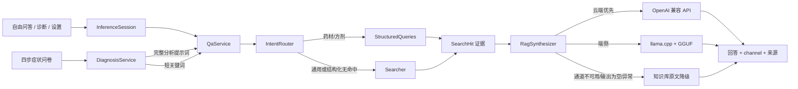

# 倪海厦中医问答


一个离线优先的 Flutter 中医学习工具：把可追溯的倪海厦经方知识库、结构化检索、端侧 GGUF 模型和可选云端增强组合在同一条问答链路里。项目重点不是替代医生，而是展示一个可解释、可降级、可测试的 AI 应用工程实现。

> 本 App 仅用于中医学习与研究，不构成医疗建议。如有健康问题，请咨询执业医师。

## 你可以用它做什么

- **自由问答**：从内置 SQLite 知识库检索经方、药材、条文和医案，并展示来源。
- **引导式诊断**：通过四步症状问卷整合寒热、汗出、疼痛、口渴和发热，提交后才调用统一的检索/RAG 推理链；信息不足时不发起请求。
- **端侧 RAG**：配置 Qwen3 GGUF 后，在设备本地用 llama.cpp 归纳检索证据，断网也能工作。
- **云端增强**：在设置中填写 OpenAI 兼容 Base URL、API Key 和模型名后，可启用云端优先问答、拍照分析和 Live 对话；云端失败会自动回到端侧或原文检索。
- **可追溯回答**：回答与 `source · heading` 来源列表分离展示，便于复核原文。

## 为什么适合用来讲 AI 工程

这个仓库可以作为一个面试中的端到端 AI 应用案例，重点在“系统如何在不确定条件下保持可用”，而不是只展示一次模型调用：

| 能力 | 输入 | 处理 | 输出/降级 |
|---|---|---|---|
| 共享推理会话 | 自由问答与诊断页面 | `InferenceSession` 统一管理 `QaService`、云端配置、端侧模型生命周期和模式切换 | 两个入口复用同一模型实例；切换失败仍保留检索 |
| 诊断编排 | 四步症状输入 | `DiagnosisService` 生成完整分析提示词，同时生成稳定的短检索词；`DiagnosticEngine` 只作为可解释规则基线 | RAG/模型回答 + 规则线索 + 来源；无症状不请求 |
| 意图路由 | 用户自然语言 | `IntentRouter` 区分诊断、药材/方剂和通用问题，并做同义词归一 | 结构化优先；无法识别时走通用检索 |
| 轻量检索 | 查询词、SQLite 知识库 | `Searcher` 使用 `LIKE` 子串召回，Dart 侧做部分命中和排序 | 命中原文 + 来源；无命中提示资料不足 |
| 结构化检索 | 药材/方剂/条文关键词 | `StructuredQueries` 访问 `herbs`、`formulas`、`tiao_wen` 表，并兼容古名/现代名 | 结构化证据；为空时回到子串检索 |
| RAG 合成 | 查询 + 前 8 条证据 | `RagSynthesizer` 控制 prompt 预算，按云端 → 端侧顺序生成 | 空输出、异常或无模型时回退知识库原文 |
| 模型解析 | GGUF 资源/应用文档目录 | `LlmModelResolver` 首次启动复制资源，`LlmService` 通过 llama.cpp 加载 | 加载失败不阻塞 App，设置页显示真实状态 |
| 云端增强 | 安全存储的 API Key 和 Base URL | OpenAI 兼容 chat、拍照分析、Live 通道 | 云端失败记录原因并落回端侧/检索 |

默认模式是“云端优先”：没有云端配置时不会偷偷联网，端侧模型可用则走端侧，否则直接返回检索原文。设置页也支持切换为“端侧模型”或“纯检索”。

## 架构与问答数据流



核心代码按职责分层：

```text
app/lib/
├── core/       Drift 数据库、模型和资源加载
├── retrieval/  意图路由、同义词、结构化查询、检索和答案组装
├── llm/        GGUF 模型解析、llama.cpp 服务、RAG prompt 和合成
├── cloud/      OpenAI 兼容客户端、拍照分析和 Live 对话
├── rules/      诊断编排服务与可解释规则基线
└── ui/         问答、诊断、设置和来源/免责声明组件
tools/
├── parsers/    Markdown → 结构化记录的解析器
└── build_kb.py 生成 app/assets/kb/kb.sqlite3
```

## 快速开始

### 1. 准备 Python 工具链和知识库

```bash
cd tools
python3 -m venv .venv
.venv/bin/pip install -r requirements.txt
git clone --depth 1 https://github.com/jangviktor-web/nihaixia.git data/nihaixia
.venv/bin/python build_kb.py --repo data/nihaixia --out out
cp out/kb.sqlite3 ../app/assets/kb/kb.sqlite3
```

知识库原始仓库使用 MulanPSL-2.0；`tools/data/` 和 `tools/out/` 被 `.gitignore` 排除，避免把源资料和构建产物提交进来。

### 2. 准备端侧模型

纯检索逻辑不依赖模型，但当前 `pubspec.yaml` 将模型路径注册为 Flutter asset，因此要执行 `flutter test` 或构建 App，需先放置文件：

| 项 | 值 |
|---|---|
| 模型 | `Qwen3.5-0.8B-Q6_K.gguf` |
| 来源 | [ModelScope：Qwen3.5-0.8B-GGUF](https://www.modelscope.cn/models/lmstudio-community/Qwen3.5-0.8B-GGUF) |
| 目标路径 | `app/assets/models/Qwen3.5-0.8B-Q6_K.gguf` |
| 体积 | 约 628MB |
| 许可 | Apache-2.0（以模型仓库说明为准） |

模型文件已被 `*.gguf` 忽略，不会入库。首次运行时 `LlmModelResolver` 会把打包资源复制到应用文档目录，之后由文件系统路径加载。

### 3. 运行 Flutter App

```bash
cd app
flutter pub get
flutter run
```

没有可用模型时，运行时会降级到纯检索；如果要验证这个降级路径，可以在设置页选择“纯检索”。

## 品牌资源与平台启动页

本项目使用“经方印章”视觉系统：朱砂红 `#9E3D32`、宣纸米色 `#F3EAD8`、墨色 `#3F2B25` 和旧金 `#C9A67E`。源文件和生成器位于 [`app/assets/branding/`](app/assets/branding/)：

```bash
brew install librsvg
python3 app/assets/branding/generate_assets.py --root .
```

生成器会更新 Android `mipmap-*`、Android 启动图、iOS `AppIcon.appiconset` 和 `LaunchImage.imageset`。资源接入说明见 [`app/assets/branding/README.md`](app/assets/branding/README.md)。

## 测试与构建

```bash
cd app
flutter analyze
flutter test
flutter build apk --debug
flutter build ios --no-codesign --simulator
```

`flutter test` 默认跳过需要真实模型的测试；模型就位后可显式运行：

```bash
flutter test --run-skipped test/llm_real_test.dart
```

工具链单测需要先安装 `tools/requirements.txt`：

```bash
cd tools
.venv/bin/python -m pytest
```

## 面试演示建议（约 5 分钟）

1. **产品入口（30 秒）**：展示三页结构和免责声明，说明“学习/研究工具”边界。
2. **检索证据（60 秒）**：问一个方剂或药材问题，展开来源列表，展示古名/现代名兼容和 SQLite 可追溯性。
3. **RAG 路径（90 秒）**：在设置页切到端侧或云端优先，说明证据如何进入 prompt、通道如何标注。
4. **故障降级（60 秒）**：关闭模型或模拟云端失败，展示回答回到检索原文而非崩溃。
5. **工程验证（60 秒）**：展示 `RagSynthesizer`、`LlmModelResolver`、结构化查询测试，以及 Android/iOS 资源构建结果。

## 已知限制与取舍

- 检索主路径刻意不依赖 FTS5 或 jieba，使用 SQLite `LIKE` + Dart 侧评分，部署简单但中文长查询的召回仍有限。
- 部分 `tiao_wen` 结构化命中未排序；端侧/云端合成可缓解，纯检索模式下可能看到原文噪声。
- 端侧模型约 628MB（Qwen3.5-0.8B-Q6_K），首次复制和加载需要时间，设备内存也会影响体验。
- `llama_cpp_dart` 的原生库已随 Android/iOS 工程预置；本地真机构建仍需要对应 Xcode、CocoaPods、JDK/NDK 环境。
- 云端能力需要用户自行提供兼容 API 配置；API Key 仅存本机 Keychain/Keystore，不在仓库中保存。

## Qwen3.5 原生推理层升级

`Qwen3.5-0.8B-Q6_K.gguf` 的 GGUF 架构标识是 `qwen35`，旧版 llama.cpp 只认识 `qwen3`，因此会在模型加载阶段报 `unknown model architecture`。本项目已将 `app/third_party/llama_cpp_dart/src/llama.cpp` 升级到包含 Qwen3.5/Qwen3.5-MoE 图实现的上游快照 `b21e4de`，并保留 `llama_abi_shim` 兼容现有 Dart FFI。

升级要点：

- `llama-arch`、GGUF 元数据和 Qwen3.5/线性注意力算子一并升级，不能只添加一个架构枚举。
- ABI shim 将旧的 `llama_kv_cache_clear` 映射到新版本的 memory API，旧 Dart 接口无需改动。
- Android 已预编译 `arm64-v8a` 和 `x86_64` 的 `libllama.so`；iOS `xcframework` 同时更新真机和模拟器静态库。

若需要重新生成原生库，使用 Android NDK 和 CMake（路径按本机环境调整）：

```bash
cmake -S app/third_party/llama_cpp_dart/src \
  -B /tmp/llama-android-arm64 \
  -DCMAKE_TOOLCHAIN_FILE="$ANDROID_NDK/build/cmake/android.toolchain.cmake" \
  -DANDROID_ABI=arm64-v8a -DANDROID_PLATFORM=android-23 \
  -DCMAKE_BUILD_TYPE=Release -DGGML_OPENMP=OFF \
  -DLLAMA_BUILD_TESTS=OFF -DLLAMA_BUILD_EXAMPLES=OFF \
  -DLLAMA_BUILD_SERVER=OFF -DLLAMA_BUILD_TOOLS=OFF \
  -DLLAMA_BUILD_COMMON=OFF
cmake --build /tmp/llama-android-arm64 --target llama_abi_shim -j2
```

Android 产物应复制到 `app/third_party/llama_cpp_dart/android/src/main/jniLibs/<abi>/libllama.so`。iOS 使用同一 CMake 工程，设置 `-DLLAMA_ABI_SHIM_STATIC=ON`，分别构建 `iphoneos/arm64` 与 `iphonesimulator/arm64;x86_64`，再将 shim、llama、ggml 静态库合并为 xcframework 中的 `libllama_combined.a`。构建完成后可用以下命令确认 ABI 和架构：

```bash
nm -D app/third_party/llama_cpp_dart/android/src/main/jniLibs/arm64-v8a/libllama.so \
  | grep -E 'llama_(backend_init|modern_model_load_from_file)'
lipo -info app/ios/Runner/Frameworks/llama.xcframework/ios-arm64_x86_64-simulator/libllama_sim_universal.a
```

## 许可与免责声明

知识库来源为 [nihaixia](https://github.com/jangviktor-web/nihaixia)，遵循其 MulanPSL-2.0 许可；模型遵循模型仓库的 Apache-2.0 说明。项目代码和数据使用方式请以各自目录中的许可/说明为准。

本 App 仅用于中医学习与研究，不构成医疗建议，不替代医生诊断、处方或治疗。出现急症或持续不适时，请及时就医。
